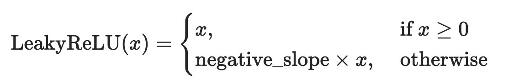
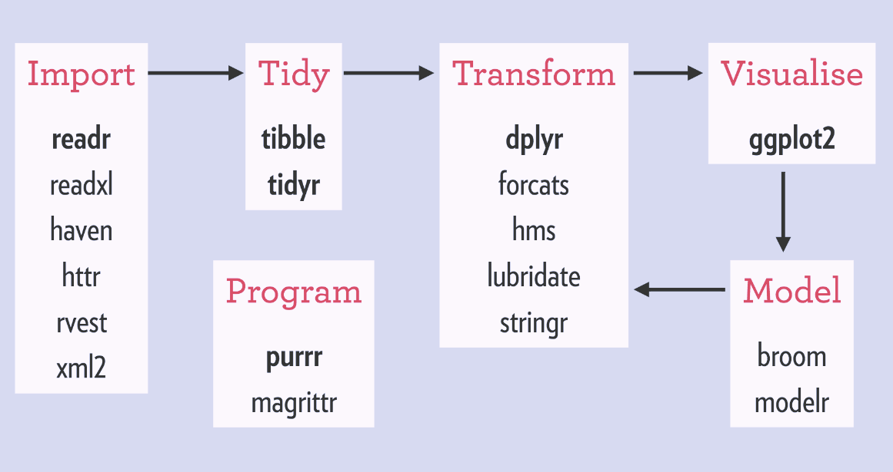
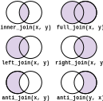

## Topic overview {.scrollable}

What will be covered:

1. **Programming logics in R**
    - If-else statements
    - For-loops
    - Piping in R

2. **Data manipulation in R**
    - Into the `tidyverse`
    - Data manipulation with `tidyverse` functions
    - Joining dataframes
    - Pivotting dataframes into long and wide formats

3. **Advance advance R**
    - Vectorisation in R with `map()`

# Programming logics in R

## If-else

- R provides *conditional* logic: depending on the outcome of a test, execute a specific statement

```{.r}
if (logical statement) {
    do this
} else {
    do that
}
```

## If-else

- Logic statements are any statement (piece of R code) that provides a TRUE/FALSE result

```{r}
24 < 50 # This is a logic statement
TRUE & FALSE # This is also a logic statement
"R programming" == "fun" # Still a logic statement
TRUE # Believe it or not, still a logic statement
100 %in% seq(50, 120, 2) # Also logic statement
```


## If-else

- Example:

```{r}
x <- 10

if (x == 10) {
  print("x is 10")
} else {
  print("x is not 10")
}

```

## If-else

- You can infinitely* add more "branches" to if-else with `else if`

```{.r}
if (logical statement 1) {
    do this
} else if (logical statement 2) {
    do that
} else if (logical statement 3) {
    do something different
} else {
    do something other thing
}
```

::: {.footnote}
*: it is technically possible but of course you should not add too much `else if`s; make sure that your code is readable and understandable
:::

## If-else

- Example:

```{r}
x <- 24

if (x < 10) {
  print("x is less than 10")
} else if (x < 20) {
  print("x is greater than 10 and less than 20")
} else if (x < 30) {
  print("x is greater than 20 and less than 30")
} else {
  print("x is greater or equal to 30")
}
```

## If-else

- Another example:

```{r}
target_year <- 2025

if ((target_year %% 4 == 0 & target_year %% 100 != 0) |
  (target_year %% 400 == 0)) {
  print(paste0(target_year, " is a leap year."))
} else {
  print(paste0(target_year, " is not a leap year."))
}
```

## If-else

- You can assign the resulting value if you want:

```{r}
x <- 24

y <- if (x < 10) {
  "x is less than 10"
} else if (x < 20) {
  "x is greater than 10 and less than 20"
} else if (x < 30) {
  "x is greater than 20 and less than 30"
} else {
  "x is greater or equal to 30"
}

print(y)
```


## If-else

- You may also stumble into `ifelse()`

```{r}
print(ifelse(x > 10, "x is larger than 10", "x is smaller than 10"))
# ?ifelse
```

- It is basically the same, a one-liner version of the typical `if (...) {...} else {...}` structure

## For-loop

- Imagine that you have to repeat the same analysis for many files that are all in the same folder on your computer
- A solution for that might be an iterative construct like a for-loop:

```{.r}
files <- dir()

for (filename in files) {
    infile <- read.table(filename, ...)
    do something with `infile`
}
```

## For-loop

- An simple example simulating $R_0$:

```{r}
vec <- rep(0, 50) # 50 time steps
vec[1] <- 2 # starting number of infectious
r0 <- 1.5 # basic reproduction number R_0

# loop from the 2nd time step to the end of vector
for (i in 2:length(vec)) {
  # get the number of infectious at current time step (starting at 2)
  vec[i] <- vec[i - 1] * r0
}

vec
```

## For-loop
```{r}
#| fig-align: center
plot(vec)
lines(vec)
```

## Conditionals within for-loops {.scrollable}

- Let's combine if-else logics with for-loops:



```{r}
vec <- seq(-10, 10)
neg_slope <- 0.01

for (i in 1:length(vec)) {
  x <- vec[i]
  if (x >= 0) {
    vec[i] <- x
  } else {
    vec[i] <- x * neg_slope
  }
}

vec
```

## Conditionals within for-loops

```{r}
#| fig-align: center
plot(vec)
lines(vec)
```


## Piping in R {.scrollable}

::: {.incremental}
-   Typically in R, we perform a sequence of operations on a dataset, changing it as we go
-   R has a *functional style*, which means the structure is typically: `new_data <- function(data, extra_arguments)`
    -   `function` describes your **action**, what you want to do
    -   `data` is the data that you are execute the action on
    -   `extra_arguments` are (optional) **settings** that changes how the action is performed
    -   `new_data` is the **output**, what you get after performing the action
:::

## Piping in R

- Example code

```{.r}
plot_dat <- ungroup(summarise(group_by(mtcars, gear), mean_mpg = mean(mpg)))

ggplot(plot_dat, aes(x = gear, y = mean_mpg)) +
  geom_col()
```

::: {.fragment}
- How easy is it to understand/follow this code?
- Can we improve the readability?
:::

## Piping in R {.scrollable}

::: {.fragment}
-   The example code can be rewritten as:

```{.r}
grouped_by_gear <- group_by(mtcars, gear)
mean_mpg_by_gear  <- summarise(grouped_by_gear, mean_mpg = mean(mpg))
ungrouped_data <- ungroup(mean_mpg_by_gear)

ggplot(
  data = ungrouped_data,
  aes(x = gear, y = mean_mpg)
) +
  geom_col()
```
:::


::: {.fragment}
-   Is this a better way to write it? Can we improve it even further?
-   If we are performing a sequence of actions, each using the output of the previous action, we can use **pipe**
:::


## Piping with `|>` {.scrollable}

::: {.incremental}
-   **Pipe** is a powerful tool to express a sequence of actions (functions)
-   It helps you write code that is easier to read and understand
-   In R, you can **pipe** between functions using the `|>` *operator*
-   Rstudio shortcut: **Cmd+Shift+M** or **Ctrl+Shift+M**
:::

::: {.callout-note .fragment}
### `|>` vs. `%>%`

- `|>` comes from R since version 4.1.0. It functions largely the same as `%>%` but not identical
- `%>%` comes from the `magrittr` package which is used by all of `tidyverse`
- **In this course we will use `|>`**
:::


## Piping with `|>`

- Pipes transfer the data from its left-hand side (LHS) to the function on its right-hand side (RHS) **as the first argument of that function**
- The structure: 
```{.r}
new_data <- data |> function(extra_arguments)
```

## Piping with `|>`

For example:

```{.r}
group_by(mtcars, gear)
```

is exactly the same as

```{.r}
mtcars |> group_by(gear)
```

## Piping with `|>`

Another example:

```{.r}
summarise(group_by(mtcars, gear), mean_mpg = mean(mpg))
```

is exactly the same as

```{.r}
mtcars |> group_by(gear) |> summarise(mean_mpg = mean(mpg))
```

## Piping with `|>`

- Using pipe, we can now rewrite the code as:

```{.r}
plot_dat <- mtcars |> 
  group_by(gear) |> 
  summarise(mean_mpg = mean(mpg)) |> 
  ungroup()

plot_dat |> 
  ggplot(aes(x = gear, y = mean_mpg)) +
  geom_col()
```

- For you, is it better/faster to understand what's happening now?

## Piping with `|>` {.scrollable}

Quick comparison

```{.r}
grouped_by_gear <- group_by(mtcars, gear)
mean_mpg_by_gear  <- summarise(grouped_by_gear, mean_mpg = mean(mpg))
ungrouped_data <- ungroup(mean_mpg_by_gear)

ggplot(
  data = ungrouped_data,
  aes(x = gear, y = mean_mpg)
) +
  geom_col()
```

vs. 

```{.r}
plot_dat <- mtcars |> 
  group_by(gear) |> 
  summarise(mean_mpg = mean(mpg)) |> 
  ungroup()

plot_dat |> 
  ggplot(aes(x = gear, y = mean_mpg)) +
  geom_col()
```

# Data manipulation in R

## Into the `tidyverse`

- `tidyverse` is a **collection of R packages** built for data science
- Provide alternatives to base R functionalities  
- All packages shared the same principle of **tidy data**

## Into the `tidyverse`



## Tidy data

- A dataset with rows and columns
- Each *column* is a *variable*
- Each *row* is an *observation*
- Each *cell* contains *1 value* only

## Tidy data

Which of these is a *tidy data* table

```{r}
#| echo: false
tibble::tribble(
  ~country, ~code, ~"2015", ~"2016",
  "Aruba", "ABW", 28419.264, 28449.713,
  "Albania", "ALB", 3952.8036, 4124.055
)
```

or

```{r}
#| echo: false
tibble::tribble(
  ~country, ~code, ~year, ~gdp,
  "Aruba", "ABW", 2015, 28419.2645,
  "Aruba", "ABW", 2016, 28449.713,
  "Albania", "ALB", 2015, 3952.8036,
  "Albania", "ALB", 2016, 4124.055,
)
```

## Why `tidyverse`?

::: {.callout-important}
### Takeaway points

1.  `tidyverse` is not a replacement of base R. **It is just a collection of R packages**
2.  You don't have to use `tidyverse` when using R
3.  `tidyverse` has most functions for data science needs. Though, there are times base R will be needed, and might be better/easier/faster
:::

## Into the `tidyverse` {.scrollable}

`tidyverse` functions that we will be using:

::: {.incremental style="font-size: 75%;"}
- `dplyr::select()` to select columns from a `tibble`
- `dplyr::mutate()` to modify and create columns in a `tibble`
- `tidyr::pivot_longer()` to transform a `tibble` from wide to long format (less columns, more rows)
- `tidyr::pivot_wider()` to transform a `tibble` from long to wide format (less rows, more columns)
- `purrr::map()` to performing vectorisation of function on vectors in R
:::

::: {.callout-note .fragment}
`tibble` is a type of dataframe that is used by all `tidyverse` functions
:::

## Before we start {.scrollable}

- Create a new R script
- Import `tidyverse` (or install first if you don't have it) and `readxl`
- Import the `Titanic3.xlsx` dataset

```{r}
# install.packages("tidyverse")
library(tidyverse)
library(readxl)

titanic_df <- read_excel("data/Titanic3.xlsx")

# check if `titanic_df` is a tibble
# (`read_excel()` is part of the `tidyverse` so it automatically converts the dataset into a `tibble`)
is_tibble(titanic_df)

titanic_df
```

## Select columns

- You can select columns from a `tibble` with `select()`

```{r}
titanic_df |> select(pclass, survived, sex, age)
```

## Select columns

- You can *unselect* columns with the `-` operator
```{r}
titanic_df |>
  select(-sex, -age) |>
  colnames()

titanic_df |>
  select(-c(name, embarked, boat, body)) |>
  colnames()
```

## Create and/or modify columns {.scrollable}

- You can create new columns or modify existing columns with `mutate()`
- Example: modify columns to their correct data type and create a new column for year of birth

```{r}
titanic_df |>
  select(pclass, survived, sex, age) |>
  mutate(
    pclass = as.factor(pclass),
    survived = as.factor(survived),
    sex = as.factor(sex),
    age = as.numeric(age),
    yob = 1912 - age
  )
```

## Create and/or modify columns {.scrollable}

- You can also work on the same column multiple times in one `mutate()`, the modifications will be run sequentially

```{r}
titanic_df |>
  select(pclass, survived, sex, age) |>
  mutate(
    pclass = as.factor(pclass),
    survived = as.factor(survived),
    sex = as.factor(sex),
    age = as.numeric(age),
    age = round(age),
    yob = 1912 - age
  )
```

## Create and/or modify columns {.scrollable}

- To run the same function for multiple columns, you can use `across()`
```{r}
titanic_df |>
  select(pclass, survived, sex, age) |>
  mutate(
    across(c(pclass, survived, sex), as.factor),
    age = as.numeric(age),
    age = round(age),
    yob = 1912 - age
  )
```

## Joining dataframes




## Joining dataframes

- Example: you have a dataframe that maps the passenger class to its ticket name
```{r}
pclass_names <- tribble(
  ~pclass, ~name,
  "1st", "First class",
  "2nd", "Business",
  "3rd", "Economy"
)

pclass_names
```


## Joining dataframes {.scrollable}

- Now, for that to be a new column of the dataset, you can **join** the dataframes
- ... but which type of join do we want to use?


## Joining dataframes

::: {.callout-important}
- Direction matters: the left dataframe and right dataframe are **not interchangable**
- Make sure the key columns exist on both dataframes
:::


## Joining 

- For our example, we will do a left join, where the original dataframe is the left, and the passenger class name dataframe is on the right
```{r}
left_join(
  titanic_df |> select(pclass, name),
  pclass_names,
  by = "pclass"
)
```