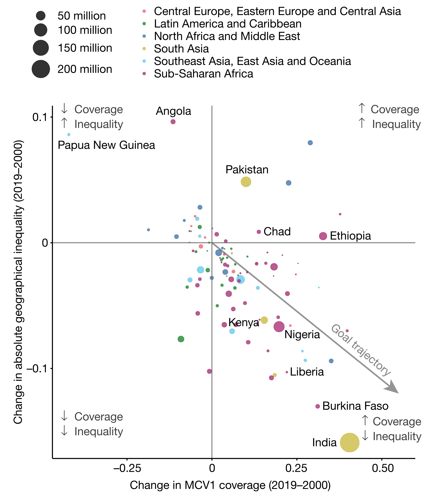

## Scatter plot

:::::: columns
:::: {.column width="50%"}


::: {style="font-size: 50%;"}
"Mapping routine measles vaccination in low-and middle-income countries." *Nature* 589, no. 7842 (2021): 415-419. (IF 2023 = 50.5).
:::
::::

::: {.column width="50%"}
How do you read this plot?
:::
::::::

## Scatter plot

:::::: columns
:::: {.column width="50%"}


::: {style="font-size: 50%;"}
"Mapping routine measles vaccination in low-and middle-income countries." *Nature* 589, no. 7842 (2021): 415-419. (IF 2023 = 50.5).
:::
::::

::: {.column width="50%"}
What information would you need to map each dot correctly onto this plot?

-   Country name
-   Position
-   Size
-   Color
:::
::::::

## Scatter plot

+------------+------------+--------------+--------------+--------------------+
| label      | x          | y            | size         | color              |
|            |            |              |              |                    |
| (country)  | (coverage) | (inequality) | (population) | (region)           |
+============+============+==============+==============+====================+
| Nigeria    | 0.20       | -0.07        | 220M         | Sub-Saharan Africa |
+------------+------------+--------------+--------------+--------------------+

::: {.codewindow .r}
code.r
```{r}
#| eval: FALSE
df <- readRDS("../data/nature_plot.rds")
head(df)
```
:::

```{r}
#| echo: FALSE
df <- readRDS("../data/nature_plot.rds")
head(df)
```


## Scatter plot

:::::: columns
:::: {.column width="50%"}


::: {style="font-size: 50%;"}
"Mapping routine measles vaccination in low-and middle-income countries." *Nature* 589, no. 7842 (2021): 415-419. (IF 2023 = 50.5).
:::
::::

::: {.column width="50%"}
Let's draw this by hand
:::
::::::

## Draw this by hand

:::::: columns
:::: {.column width="50%"}


::: {style="font-size: 50%;"}
"Mapping routine measles vaccination in low-and middle-income countries." *Nature* 589, no. 7842 (2021): 415-419. (IF 2023 = 50.5).
:::
::::

::: {.column width="50%"}
-   Draw the axes
-   Draw the data points
-   Adjust dot sizes
-   Colour-code the regions
-   Add key country labels
:::
::::::

# ggplot

Create Elegant Data Visualisations Using the **Grammar of Graphics**.

::: {.codewindow .r}
code.r
```{r}
#| warning: FALSE
#| message: FALSE
library(ggplot2)
```
:::

## Draw the axes

:::: columns

::: {.column width="50%"}

::: {.codewindow .r}
code.r
```{r}
#| eval: FALSE
ggplot(df, aes(x = coverage, y = inequality))
```
:::
:::

::: {.column width="50%"}

```{r}
#| echo: FALSE
#| fig-width: 5
#| fig-height: 5
#| out-width: "100%"
ggplot(df, aes(x = coverage, y = inequality))
```

:::

::::

## Draw the data points

:::: columns

::: {.column width="50%"}

::: {.codewindow .r}
code.r
```{r}
#| eval: FALSE
#| code-line-numbers: "2"
ggplot(df, aes(x = coverage, y = inequality)) +
  geom_point()
```
:::
:::

::: {.column width="50%"}

```{r}
#| echo: FALSE
#| fig-width: 5
#| fig-height: 5
#| out-width: "100%"
ggplot(df, aes(x = coverage, y = inequality)) +
  geom_point()
```

:::

::::

## Adjust dot sizes

:::: columns

::: {.column width="50%"}

::: {.codewindow .r}
code.r
```{r}
#| eval: FALSE
#| code-line-numbers: "2"
ggplot(df, aes(x = coverage, y = inequality)) +
  geom_point(aes(size = size))
```
:::
:::

::: {.column width="50%"}

```{r}
#| echo: FALSE
#| fig-width: 5
#| fig-height: 5
#| out-width: "100%"
ggplot(df, aes(x = coverage, y = inequality)) +
  geom_point(aes(size = size))
```

:::

::::

## Colour-code the regions

:::: columns

::: {.column width="50%"}

::: {.codewindow .r}
code.r
```{r}
#| eval: FALSE
#| code-line-numbers: "2"
ggplot(df, aes(x = coverage, y = inequality)) +
  geom_point(aes(size = size, color = color))
```
:::
:::

::: {.column width="50%"}

```{r}
#| echo: FALSE
#| fig-width: 5
#| fig-height: 5
#| out-width: "100%"
ggplot(df, aes(x = coverage, y = inequality)) +
  geom_point(aes(size = size, color = color))
```

:::

::::

## Add key country labels

:::: columns

::: {.column width="50%"}

::: {.codewindow .r}
code.r
```{r}
#| eval: FALSE
#| code-line-numbers: "3"
ggplot(df, aes(x = coverage, y = inequality)) +
  geom_point(aes(size = size, color = color)) +
  geom_text(aes(label = country))
```
:::
:::

::: {.column width="50%"}

```{r}
#| echo: FALSE
#| fig-width: 5
#| fig-height: 5
#| out-width: "100%"
ggplot(df, aes(x = coverage, y = inequality)) +
  geom_point(aes(size = size, color = color)) +
  geom_text(aes(label = country))
```

:::

::::

## Refine the plot

:::: columns

::: {.column width="50%"}

::: {.codewindow .r}
code.r
```{r}
#| eval: FALSE
cols <- c(
  "red" = "#fa8495",
  "green" = "#4ca258",
  "darkblue" = "#6493bb",
  "yellow" = "#d7c968",
  "blue" = "#7dd8f3",
  "purple" = "#bc5c91"
)

ggplot(df, aes(x = coverage, y = inequality)) +
  geom_point(aes(size = size, color = color), alpha = 0.8) +
  geom_text(aes(label = country), hjust = -0.2, vjust = 0.2) +
  geom_vline(xintercept = 0, color = "#999999") +
  geom_hline(yintercept = 0, color = "#999999") +
  scale_x_continuous(breaks = c(-0.25, 0, 0.25, 0.5),
                     limits = c(-0.4, 0.55)) +
  scale_y_continuous(breaks = c(-0.1, 0, 0.1), limits = c(-0.16, 0.1)) +
  scale_size_continuous(
    breaks = c(2, 4, 6, 8),
    labels = c("50 million", "100 million", "150 million", "200 million"),
    range = c(0, 8),
    guide = guide_legend(order = 1)
  ) +
  scale_color_manual(
    values = cols,
    breaks = c("red", "green", "darkblue", "yellow", "blue", "purple"),
    labels = c(
      "Central Europe, Eastern Europe and Central Asia",
      "Latin America and Caribbean",
      "North Africa and Middle East",
      "South Asia",
      "Southeast Asia, East Asia and Oceania",
      "Sub-Saharan Africa"
    ),
    guide = guide_legend(order = 2)
  ) +
  labs(x = "Change in MCV1 coverage (2019-2000)",
       y = "Change in absolute geographical inequality (2019-2000)",
       size = NULL,
       color = NULL) +
  theme_classic() +
  theme(
    legend.position = "top",
    legend.direction = "vertical",
    legend.text = element_text(size = 11),
    legend.key.height = unit(0.5, "cm"),
    axis.text = element_text(size = 11)
  )
```
:::
:::

::: {.column width="50%"}

```{r}
#| echo: FALSE
#| fig-width: 5.6
#| fig-height: 6.7
#| out-width: "100%"
cols <- c(
  "red" = "#fa8495",
  "green" = "#4ca258",
  "darkblue" = "#6493bb",
  "yellow" = "#d7c968",
  "blue" = "#7dd8f3",
  "purple" = "#bc5c91"
)

ggplot(df, aes(x = coverage, y = inequality)) +
  geom_point(aes(size = size, color = color), alpha = 0.8) +
  geom_text(aes(label = country), hjust = -0.2, vjust = 0.2) +
  geom_vline(xintercept = 0, color = "#999999") +
  geom_hline(yintercept = 0, color = "#999999") +
  scale_x_continuous(breaks = c(-0.25, 0, 0.25, 0.5),
                     limits = c(-0.4, 0.55)) +
  scale_y_continuous(breaks = c(-0.1, 0, 0.1), limits = c(-0.16, 0.1)) +
  scale_size_continuous(
    breaks = c(2, 4, 6, 8),
    labels = c("50 million", "100 million", "150 million", "200 million"),
    range = c(0, 8),
    guide = guide_legend(order = 1)
  ) +
  scale_color_manual(
    values = cols,
    breaks = c("red", "green", "darkblue", "yellow", "blue", "purple"),
    labels = c(
      "Central Europe, Eastern Europe and Central Asia",
      "Latin America and Caribbean",
      "North Africa and Middle East",
      "South Asia",
      "Southeast Asia, East Asia and Oceania",
      "Sub-Saharan Africa"
    ),
    guide = guide_legend(order = 2)
  ) +
  labs(x = "Change in MCV1 coverage (2019-2000)",
       y = "Change in absolute geographical inequality (2019-2000)",
       size = NULL,
       color = NULL) +
  theme_classic() +
  theme(
    legend.position = "top",
    legend.direction = "vertical",
    legend.text = element_text(size = 11),
    legend.key.height = unit(0.5, "cm"),
    axis.text = element_text(size = 11)
  )
```

:::

::::

